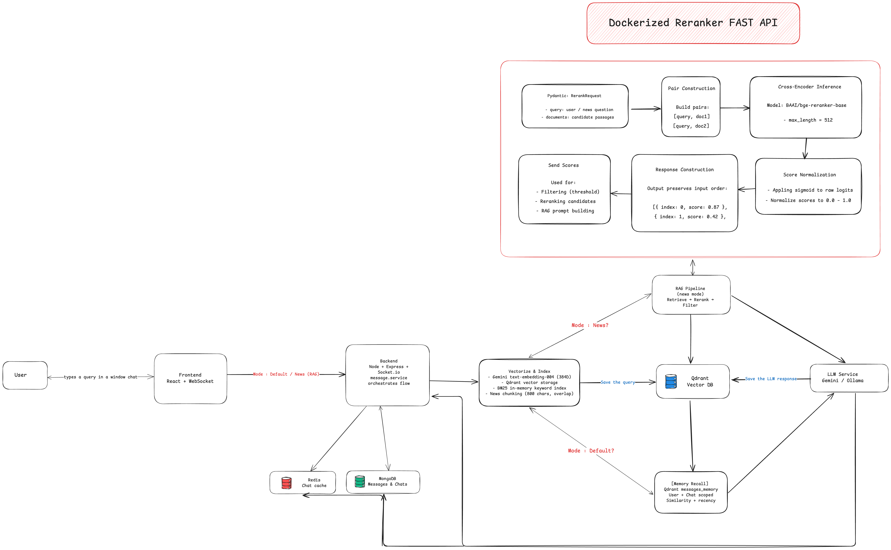

# AI Chat Client

A React-based AI Chat application offering a interface with markdown support, and chat history management.



## Prerequisites

- Node.js
- npm

## Setup & Running Locally

1. Install dependencies:

   ```bash
   npm install
   ```

2. Configure environment variables:
   Copy `.env.example` to `.env` and update the values.

   ```bash
   cp .env.example .env
   ```

3. Start the development server:
   ```bash
   npm run dev
   ```
   The application will differ at http://localhost:5173 (default Vite port).

## Production Build

Build the project for production:

```bash
npm run build
```
